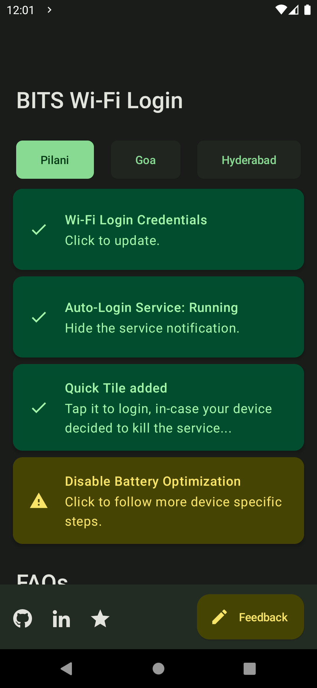

# BITS Wi-Fi Login

 

App that allows you to login to BITS (Pilani, Goa, Hyderabad) campus Wi-Fi  without requiring you to sign-in manually.

> By a student who got fed up connecting to the wi-fi login portal everytime.

## Credits

This is a fork of [sparshg/wifi-login](https://github.com/sparshg/wifi-login) by [Sparsh Goenka](https://github.com/sparshg), modernized to target the latest Android version. All credit for the original app goes to them.
